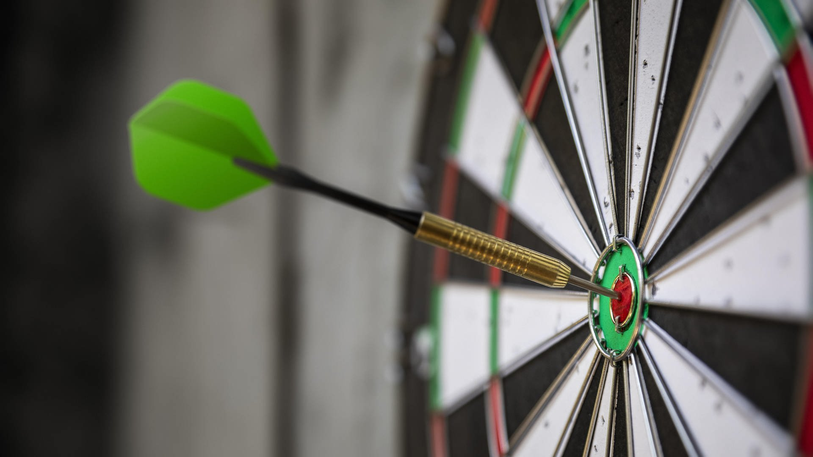
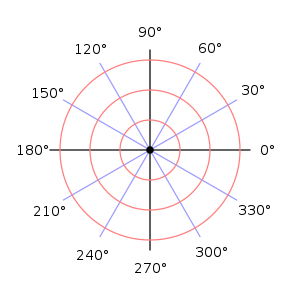
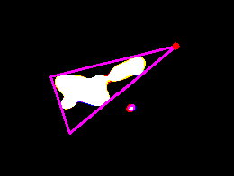
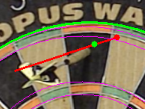
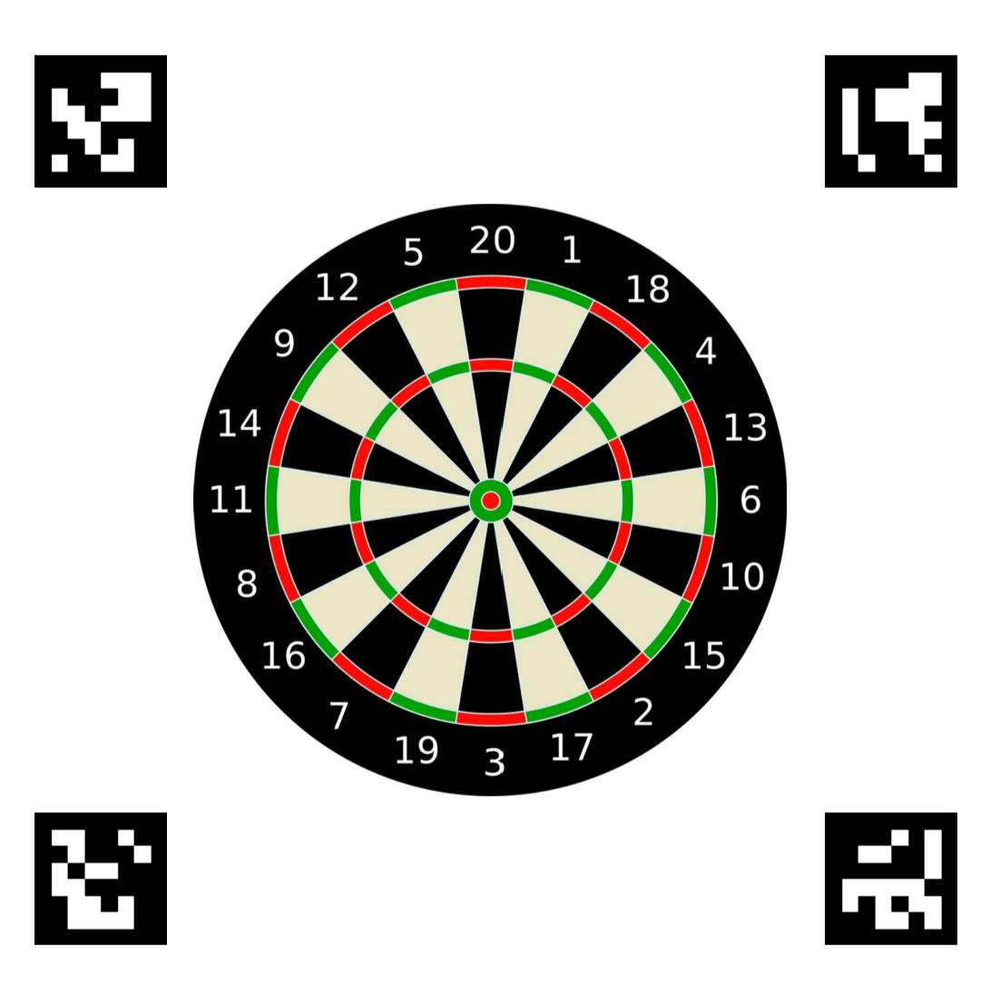
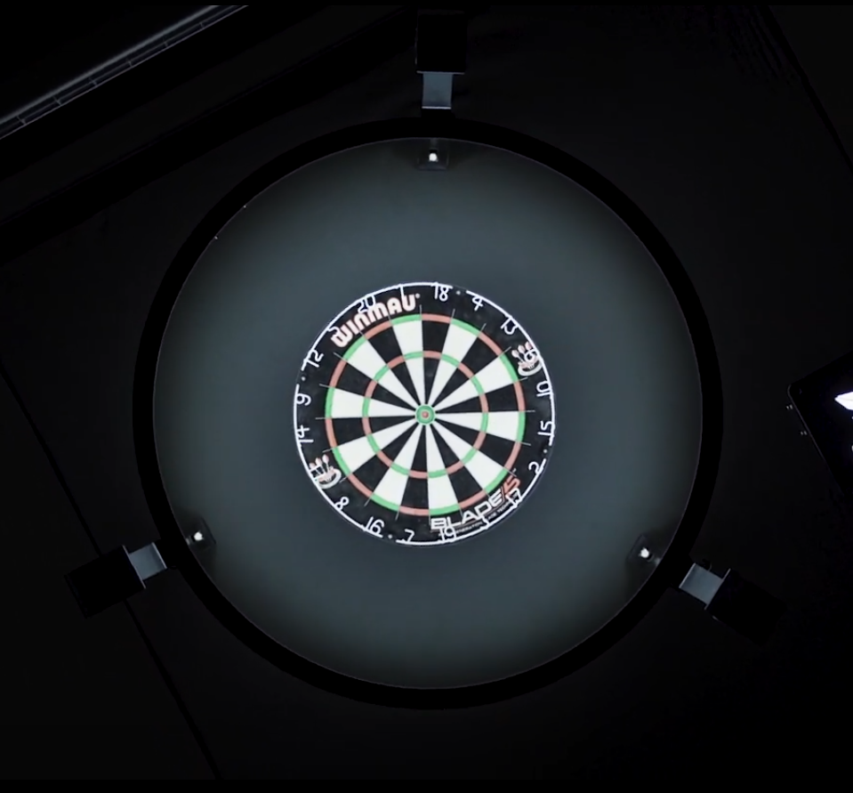
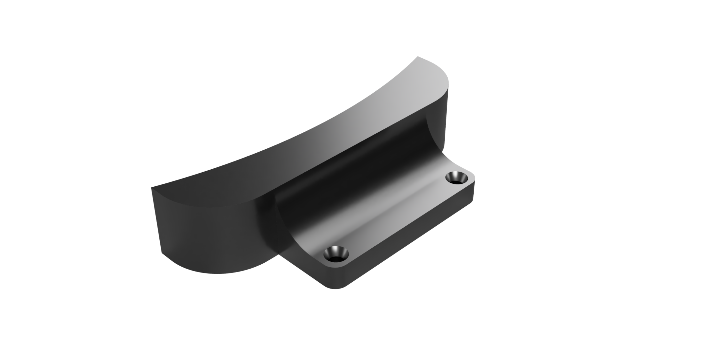
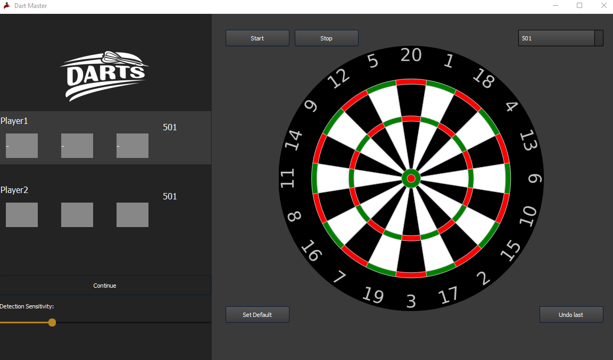

# Dart Master

## Description
This Project was part of the VR/AR course at my university TU Darmstadt. The aim of the Project was to crate an 
automatic dart scorer application, where two players can play a game of dart without focusing on the point counting.
The application uses OpenCV for the computer vision part and Pyside2 for the GUI.\
We use a calibrated webcam to capture a video stream and process it with OpenCV to extract the darts on the board and 
keep track of the players.


## Demo Video

[](https://youtu.be/gc4xopSNS6g "Video Title")


## How it works
The complete detection pipline looks something like this:
- First detect the aruco markers
- detect the dart board with a circle detector
- fit a polar coordinate system to the dart board


- take the reference image
- some filters to remove noise and improve the detection
- calculate the difference image between the reference image and the current image
- contour detection on the difference image
- contour > minimum area filter


- fit triangle to the contour
- find the tip of the dart by using the corner opposite of the shortest side
- correct the tip position by moving it to the center of the triangle relative to its size


- getting the position of the tip relative to the polar coordinate system
- Evaluation of the score with [DartScorer()](./Dart_Scoring/DartScorer.py)

The overall pipeline is summarized in this flowchart:


## Setup

### Hardware

You will need:
- a webcam
- something to mount the webcam
- a computer
- a dartboard
- the 4 aruco markers that can be found in [Resources/Doku/](Resources/Doku)

Place the Markers around the dartboard like in the image below and make sure they are visible.
Place the webcam in front of the dartboard approximately 1 meter away and slightly to the right,
so it doesn't get in the way with throwing the darts.


[](Resources/Doku/Aruco_Marker_Positions.png "Marker Positions")

Important: You need good lighting to get good results. Only Lighting from directly above the dartboard is bad.
Optimal would be a ring light with a diffusor like this:



We had some problems with shaking of the board wich induced noise in the detection.
We solved this by 3D printed mounts for the board:



### Software
Just clone the repository and run the following command:

```bash
pip install -r requirements.txt
```

First you need to calibrate the camera. This can be done with the [Calibration Script](CalibrationWithUncertainty.py).
Then you can start [main_with_gui.py](main_with_gui.py).
The GUI looks like this:



## Short Instructions
- First select your starting Points (501, 301 or 101) for your dart game.
- Then set the default image with the button "Set Default".
- After that you can start the detection with "Start"
- If the darts are detected badly you can adjust the threshold with the slider.


